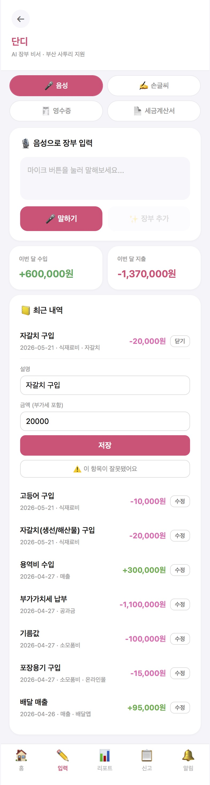
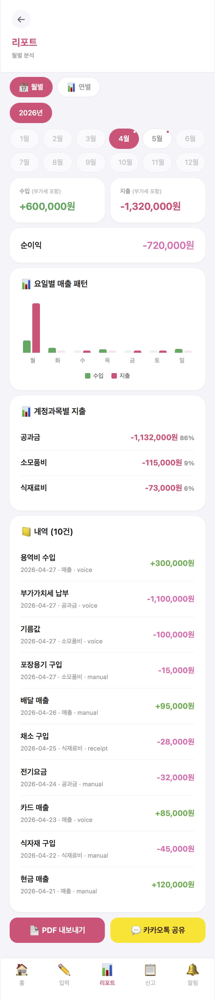
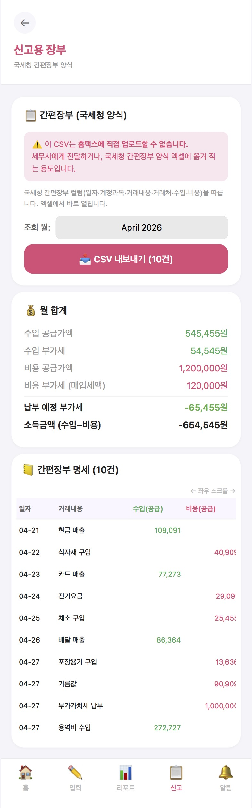

<!-- language switcher -->
[English](README.md) | **한국어**

# 단디(Dandi): AI 장부 자동화 시스템

> 오프라인 환경에서 현금 거래를 음성으로 잡아 구조화하는 시스템 —
> **부산 전통시장에서 실제로 만들어 배포하고 ≈200명에게 검증**했습니다.
>
> 카드·세무 데이터가 잡지 못하는 **비(非)카드 현금 거래**를 수면 위로 끌어올린
> 사례입니다. 현금 비중이 큰 모든 경제권에 공통으로 존재하는 구조적 사각지대죠.

[](#)
[](#)
[](#)

---

## 화면

<table>
  <tr>
    <td width="33%"></td>
    <td width="33%"></td>
    <td width="33%"></td>
  </tr>
  <tr>
    <td align="center"><b>음성 입력</b><br/>말하면 AI가 날짜·계정과목·금액을 채움</td>
    <td align="center"><b>월별 리포트</b><br/>수입·지출, 계정과목별, 요일별 차트</td>
    <td align="center"><b>신고용 장부</b><br/>부가세 분리 + 홈택스 직접 업로드 불가 명시</td>
  </tr>
</table>

<sub>시드 데모 데이터로 표시된 화면입니다.</sub>

---

## 한눈에

- **5화면짜리 작동 웹앱**(Next.js) — 음성(Whisper → Claude tool-use), 이미지
  OCR(Claude Vision + 네이버 Clova), 거래 캐싱. Vercel에 배포됨.
- 카드망·세무 데이터의 사각지대인 **비카드 현금 거래**를 포착. 현금 비중이 큰
  모든 경제권에 공통된 문제.
- **추정이 아니라 실측:** 공개 전시(2026년 5월)에서 ≈200명이 직접 사용.
  전체 API 비용 **₩1,500(≈$1.17)**, **세션당 ≈₩7.5**, 긍정 피드백 ≈80%.
- **비용 인식 설계:** 거래 캐시가 반복 거래 패턴을 활용해 재입력 시 LLM 호출을
  건너뜀. 히트/미스 이벤트는 계측되어 기록됨.
- **사람 확인 게이트:** AI 분류 결과는 항상 *미확인* 상태로 들어가고, 사용자가
  확인해야 장부에 반영됨. 오분류가 소리 없이 장부에 들어가는 일이 없음.
- **'장부 작성'까지만, 세무 신고는 안 함** — 세무사법 경계를 의도적으로 넘지 않음.

---

## 핵심 제약

> **사장님은 "아무것도 안 하는 것보다 기록이 더 빠르지 않으면" 데이터를 꾸준히
> 입력하지 않는다 — 이 제약 위에서 설계했습니다.**

이게 모든 걸 가르는 제약입니다. 음성 우선 입력, ±20% 캐시 매칭, 모달 없는
인라인 수정, 기기 내 저장 — 전부 이 기준선을 넘기 위한 선택입니다. 이걸 못
넘으면 기능이 아무리 좋아도 채택률은 0이니까요.

---

## 문제

부산 전통시장의 영세 사장님들은 장부를 손으로 씁니다 — 종이 영수증, 손글씨
장부, 구조화된 데이터 0.

더 깊은 문제는 **소상공인 매출 통계 자체가 구조적으로 불완전**하다는 점입니다.
카드망 데이터와 세무 기록은 *신고된* 거래만 잡습니다. 소상공인 매출의 상당 부분을
차지하는 현금 매출은 둘 다에게 보이지 않습니다. 한국 정부도 2024년 8월에 이 공백을
공식 인정하고 별도 매출 통계 체계를 만들겠다고 발표했습니다.

이건 한국만의 문제가 아닙니다. **현금 유통이 큰 경제권은 동일한 사각지대를
가집니다** — 동남아, 중남미, 아프리카 일부, 선진국의 일부 영역까지.

사장님 입장에선 이 공백이 세 가지 문제를 동시에 만듭니다.

- **금융 기록 부재** — 검증 가능한 거래 이력이 없어 대출·지원금 접근이 어려움.
- **세무 리스크** — 비공식 장부는 오류로 이어지고, 무기장 가산세(20%)에 노출됨.
- **이상치 무감지** — 비정상적 지출 급증을 너무 늦게야 알아챔.

단디는 비구조 입력(음성·사진·손글씨 장부)을 구조화된 금융 기록으로 바꿉니다 —
사용자 기기 위에서, 원본을 들고 있는 중앙 서버 없이.

---

## 왜 이게 AI 금융 시스템 문제인가

**1. 비구조 → 구조 금융 데이터 파이프라인.** 음성·이미지 입력을 신뢰할 수 있는
회계 기록으로 바꾸는 일은, 은행·보험·감사 시스템의 문서 인텔리전스에 요구되는
것과 같은 견고함을 필요로 합니다.

**2. 금융 건전성 이상 탐지.** 지출 경보는 사기 탐지의 핵심 패턴 —
기준선 → 편차 → 경보 — 을 따릅니다. 이걸 상인 코호트 데이터로 확장하면
보조금 오용이나 비정상 현금 흐름을 시(市) 단위에서 탐지하는 길이 열립니다.

**3. 비용 인식 AI 인프라.** 외부 LLM 호출은 사용자 수에 비례해 늘어나는 —
프로덕션 AI의 알려진 지속가능성 문제입니다. 단디의 거래 캐시는 소상공인 거래의
높은 반복성(같은 거래처, 비슷한 금액)을 활용해 반복 입력 시 LLM을 우회하고,
히트/미스를 기록해 절감량을 추정이 아닌 실측으로 보고할 수 있게 합니다.

---

## 핵심 기능

### 구현됨 (작동 앱, 5화면)

| 기능 | 스택 | 비고 |
|---|---|---|
| 음성 → 장부 | OpenAI Whisper STT → Claude Sonnet 4.6 tool-use | 2단계; 부산 사투리 도메인 프롬프트 |
| 이미지 OCR | Claude Vision; 네이버 Clova OCR 폴백 | 영수증·세금계산서·손글씨 장부 |
| 거래 캐싱 | localStorage + ±20% 범위 매칭 | 히트율 로깅; 확인된 항목만 학습 |
| 부가세 자동 분리 | 법정 10% 규칙, 합계 보존 불변식 | `lib/vat.test.ts` 14개 경계값 테스트 |
| 간편장부 CSV 내보내기 | 국세청 8컬럼 양식 | 직접 업로드 불가 한계를 UI에 명시 |
| 세무 마감 추적 | 신고 규칙 기반 동적 계산 | 부가세 + 종합소득세 |
| 거래처 관리 + 리포트 | CRUD + 월/연별 + PDF 내보내기 | 요일별 매출 차트 |

### 설계됨 (운영 단계)

| 기능 | 접근 |
|---|---|
| 동백전 결제 연동 | 결제 API 수집(현재 UI에서 데모 모드) |
| E2E 암호화 클라우드 동기화 | 현재 Supabase 백업 존재; 사용자 보유 키 E2EE는 설계 단계 |
| 시민 통계 프라이버시 | k-익명성(k≥5) + l-다양성 + 차분 프라이버시 |
| API 비용 최적화 | 캐싱(구현) → 모델 라우팅 → 소형 자체 LLM |
| 다회차 상인 현장 파일럿 | 기관 파트너 모색 중 (아래 현장 결과 참고) |

---

## 아키텍처

```
입력 레이어
  ├── 음성       (MediaRecorder → Whisper → Claude tool-use)   [구현]
  ├── 이미지     (카메라/갤러리 → Claude Vision / Clova)        [구현]
  └── 결제 API   (동백전 수집)                                  [데모 모드]
            │
   캐시 조회 ───── 히트 ──→ LLM 건너뛰고 분류 재사용
            │ (미스)
   LLM 추출 & 정규화
            │
   사용자 확인 게이트 ── (확인 시 캐시에 재기록)
            │
   로컬 기록 저장소(localStorage)  ──→  Supabase 백업(upsert, 디바운스)
            │
    ┌───────┴───────┐
  리포트          이상 경보
  (세액 추정)      (지출 급증)
            │
   CSV 내보내기(국세청 양식) → 사용자 → 세무사
```

현재 빌드에서 장부는 기기에 먼저 저장되고, Supabase는 선택적 백업만 보관합니다.
E2E 암호화 동기화와 시민 통계 경로는 운영 단계 설계이며 아직 구현 전입니다.

---

## 현장 결과 (실측)

추정만 한 게 아니라 현장에서 검증했습니다.

- **≈200명**이 공개 전시(커리어블라썸, 2026년 5월)에서 단디를 직접 사용 —
  각자 사장님 역할로 거래를 입력.
- **전체 API 비용 ₩1,500(≈$1.17)** — Anthropic $1.03 + OpenAI $0.14 —
  즉 **세션당 ≈₩7.5**.
- 종이 피드백 85건 중 **≈80% 긍정**(20건 분석 완료); 주요 개선 요청은
  로딩 속도, 앱 진입 불편, 타이핑 옵션.

정직한 노트: 이건 **부스 역할 체험이지 다회차 상인 파일럿이 아닙니다** —
실제 상인 파일럿은 아직 기관 파트너를 찾는 중입니다. 전시 당시 서버 사용 로깅
(Supabase)이 켜져 있지 않아 해당 회차의 서버 측 지표는 없으며, 위 비용 수치는
API 대시보드 기준입니다.

---

## 실패 처리

프로토타입에 박아둔, 프로덕션을 염두에 둔 선택들:

- **미확인 게이트** — 모든 AI 분류는 `미확인`으로 들어가고, 사용자가 확인해야
  세무 관련 내보내기에 반영됨.
- **인라인 수정** — 모든 필드를 그 자리에서 수정, 모달·왕복 없음(자체 테스트 ≈2초).
- **캐시는 원본이 아니라 수정 결과로 학습** — 확인된(수정 후) 항목만 캐시 시드가
  되므로, 캐시가 초기 오류를 증폭하지 않고 개선됨.
- **PII 마스킹** — 카드번호·주민번호·계좌번호를 처리 전에 마스킹.
- **LLM 실패 폴백** — API 오류 시 원본 전사를 보존한 채 수동 입력으로 넘어감;
  조용한 데이터 유실 없음.
- **내보내기 시점의 법적 고지** — 국세청 양식 CSV 화면이 홈택스에 직접 업로드할
  수 없음을 명시해, 세무사법상 오용을 방지.

---

## 엔지니어링 트레이드오프

- **파인튜닝 대신 캐싱** — 파인튜닝은 정확도 상한은 높지만 초기 비용이 약 2배수
  더 들고 데이터 축적이 필요. 반복이 많은 도메인이라 캐싱이 학습 비용 0으로
  대부분의 절감을 가져옴.
- **서버 평문 대신 로컬 우선 + Supabase 백업** — 프라이버시 기본값; 동기화는
  나중에 사용자 보유 키 E2EE로 해결하지, 서버 평문으로 되돌리지 않음.
- **자체 호스팅 대신 외부 LLM API** — 프로토타입 규모에선 매니지드 API(Whisper,
  Claude)가 더 빠르게 출시 가능; 아키텍처가 분리돼 있어 볼륨이 정당화되면
  자체 추론으로 단일 라우트 교체.
- **기능 확장보다 세무사법 준수** — 단디는 '장부 작성'에서 멈추고 신고는 안 함.
  제품을 좁히지만 비규제 영역에 머물게 함; 신고 자동화는 세무사 면허 파트너 필요.

---

## 프로젝트 맥락

부산시가 운영하는 결제 플랫폼(동백전)의 가맹점용 모듈로 설계 — 핀테크 제품에서
보통 배제되는 계층(고령 상인, 사투리 사용자, 현금 위주 운영자)을 대상으로 합니다.
2026년 1월 기준 ≈145,000개 가맹점이 이미 동백전을 쓰고 있어, 단디를 그 안에 넣으면
사용자 확보 비용이 거의 0이고 별도 앱 설치도 필요 없습니다.

운영 주체는 부산시가 프로덕션 버전을 맡길 주체에게 열어둡니다.

---

## 기술 스택

| 레이어 | 기술 |
|---|---|
| 프론트엔드 | Next.js 14 (App Router), TypeScript, Tailwind CSS |
| 음성 파이프라인 | OpenAI Whisper → Claude Sonnet 4.6 (tool-use 구조화 출력) |
| 비전 / OCR | Claude Vision(영수증·세금계산서) + 네이버 Clova OCR(손글씨 폴백) |
| 저장소 | localStorage(오프라인 우선) + Supabase PostgreSQL(백업) |
| 레이트리밋 | Upstash Redis (+ 인메모리 폴백) |
| 배포 | Vercel (서버리스) |

---

## 할 수 있는 것 (이 빌드로 증명한 역량)

- **측정 가능한 절감을 내는 비용 인식 LLM 파이프라인 구축** — 캐싱, 히트율 로깅,
  호출당 비용 추적; 비용 결정을 추정이 아닌 데이터로.
- **규제 제약 아래 금융 데이터 시스템 설계** — 한국 부가세 법령을 테스트 가능한
  불변식으로 인코딩, 세무사법 경계를 제품 범위로 매핑, 신고 요건에 맞춘 증빙 유형 구조화.
- **음성/이미지 → 구조화 데이터 종단 파이프라인 구현** — 사투리 음성, 손글씨 장부,
  영수증, 세금계산서 흐름을 일관된 확인 게이트와 함께 구현·배포.
- **설계로 끝내지 않고 출시·검증** — Vercel 배포, 200명 현장 테스트, 추정 대신
  실제 비용·피드백 수치 보고.
- **도메인 문제를 엔지니어링 스펙으로 번역** — 시민 정책 문제 → 제품 범위 →
  아키텍처, 명시적 운영 단계 인계까지.

---

## 관련 프로젝트

*비구조 신호 → 구조화 기록 → 이상 탐지* 라는 같은 패턴을 여러 금융 도메인에 적용:

> **[BakerStreet — 국경 간 사기 탐지 AI](https://github.com/si3ae/Cross-Border_Fraud_Detection_AI)** —
> 셸 컴퍼니 / 자금세탁 수사를 위한 검증 가능한 AI; 이상 탐지를 국경 간 사기
> 네트워크로 확장
>
> **[Financial Intelligence Terminal](https://github.com/si3ae/Financial_Intelligence_Terminal)** —
> 대규모 멀티에셋 시장 신호 집계

---

## 만든 사람

홍신애(Sinae Hong).

WorldQuant Brain 컨설턴트 티어(퀀트 경험 0에서 집중적인 일일 알파 제출을 통해
컨설턴트 티어 도달). 최근 컴퓨터공학으로 전향했고, 단디를
기획·개발·보안·현장 검증까지 혼자 끝까지 만들었습니다. 실세계 데이터 제약에
초점을 둔 프로덕션 지향 금융 AI 시스템입니다.

단디의 금융 도메인 엄밀함(법정 부가세 로직, 세무 마감 계산, 증빙 유형 분류)은 이
배경에서 나왔고, 엔지니어링 실행은 만들면서 병행해 익혔습니다.

[LinkedIn](https://www.linkedin.com/in/sinae-hong-583306216/)
